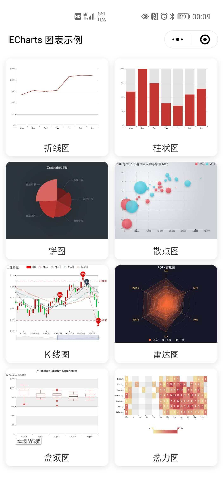
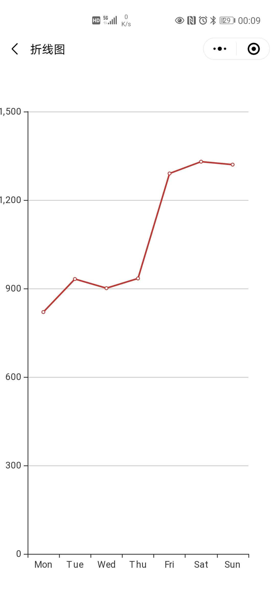
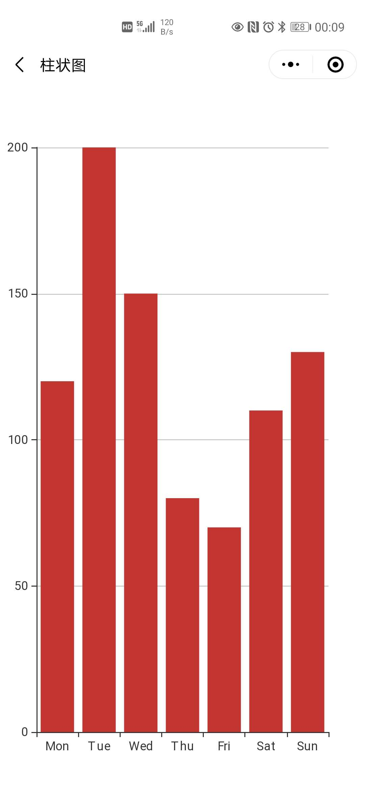
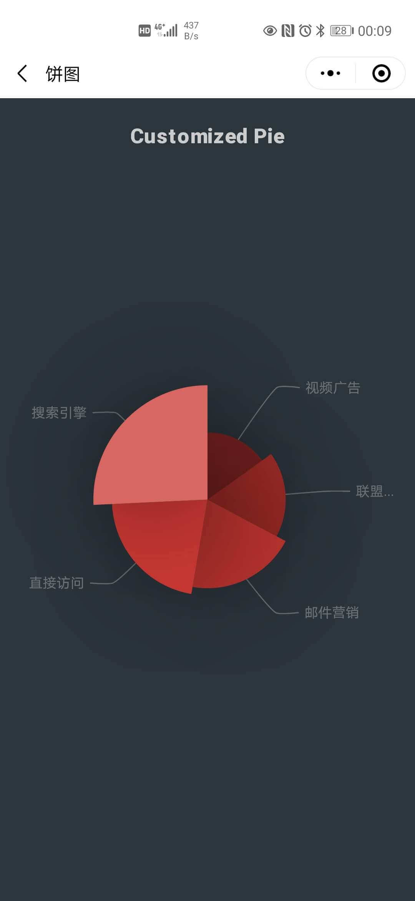
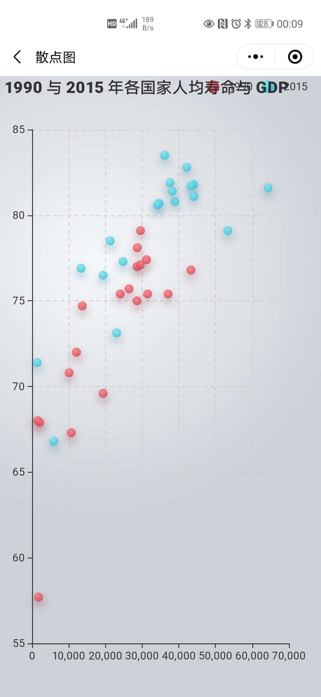
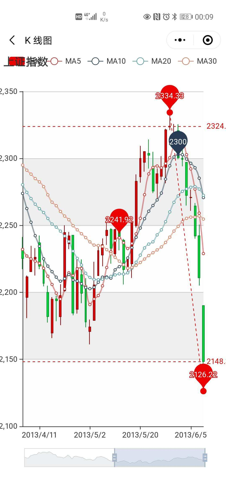
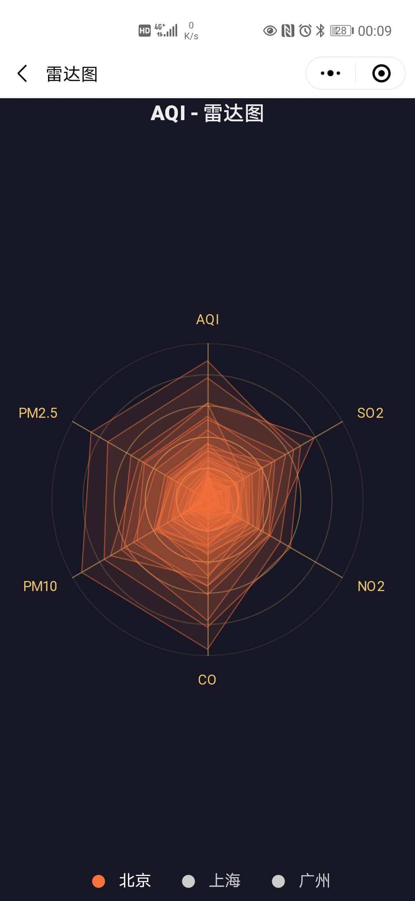
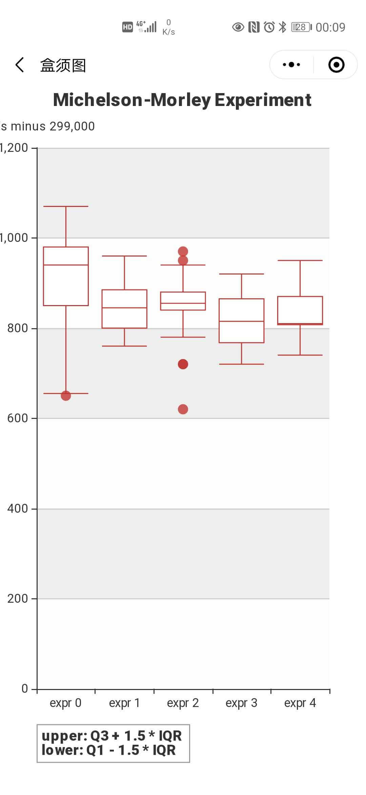
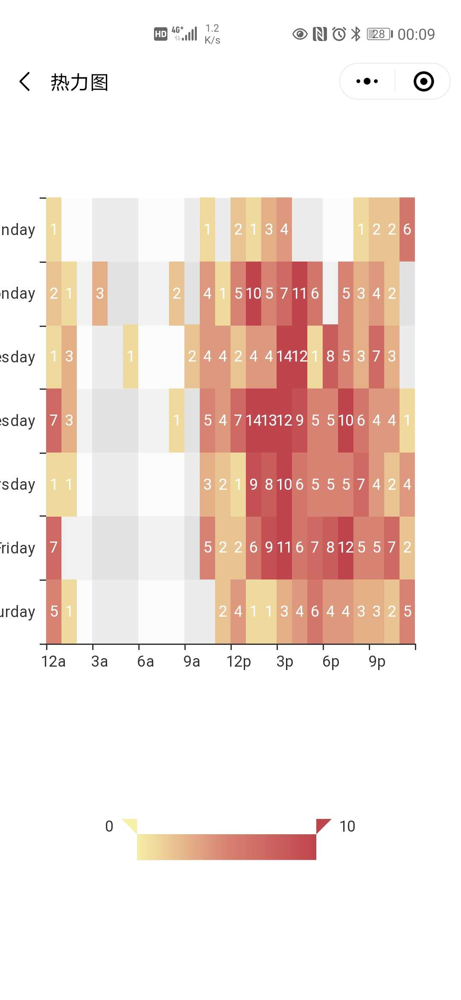

# ECharts 小程序示例

## 预览

## 示例项目运行步骤

1、申请 ECharts 图标组件插件权限，[文档地址](https://mp.weixin.qq.com/wxopen/plugindevdoc?appid=wx1db9e5ab1149ea03)，AppId：`wx1db9e5ab1149ea03`

2、克隆此项目，然后将 `project.config.json` 文件中的 appid 替换为你自己的小程序的 appid，否则运行时你会没有开发权限而无法运行项目。

完成以上两步骤后，你就可以正常运行此项目了，Good Luck
